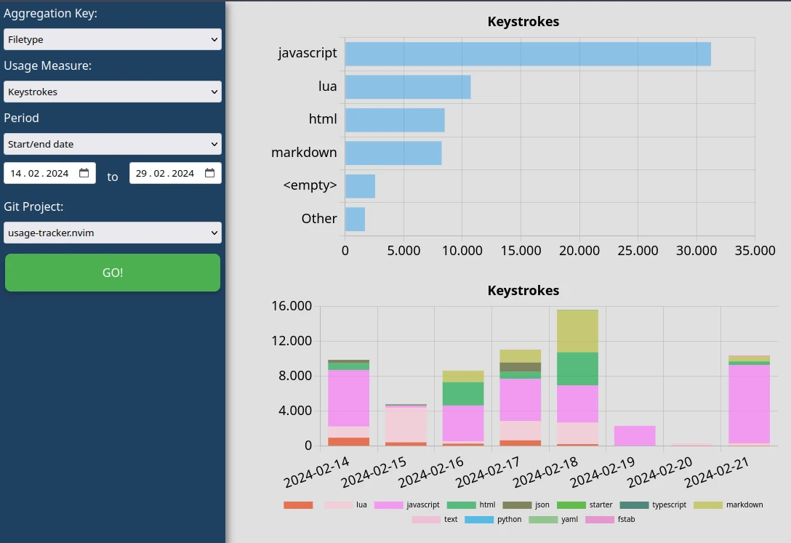

# Usage-Tracker.nvim

> The plugin is in ⚠️ active development, and you can expect breaking changes in the future.
<!-- Also the code is kind of 💩, refactoring is required.-->
<!-- Hidden remark from a contributor: It is not 💩! -->
<!-- TODO: write a vim help file -->

NeoVim plugin with which you can track your usage along git project, branch and filetype.
Logs are stored locally, so no sensitive data leaves your machine.


Use `:UsageTrackerHTML` to see your statistics.

# Setup

Use your favourite package manager, configuration parameters are optional. 

- [vim-plug](https://github.com/junegunn/vim-plug):
```lua
Plug 'gaborvecsei/usage-tracker.nvim'
```

- [lazy.nvim](https://github.com/folke/lazy.nvim)
```lua
{
  "gaborvecsei/usage-tracker.nvim",
  config = function()
    require("usage-tracker").setup({})
  end,
}
```

# Configuration

The setup function can be used to configure parameters. Pass some or all of the possible parameters.

```lua
require('usage-tracker').setup({
    keep_eventlog_days = 14,
    cleanup_freq_days = 7,
    event_wait_period_in_sec = 5,
    inactivity_threshold_in_min = 5,
    inactivity_check_freq_in_sec = 5,
    verbose = 0,
    telemetry_endpoint = "" -- you'll need to start a REST API endpoint for this
})
```

| Parameter                      | Description                                                                  | Type | Default |
| ------------------------------ | ---------------------------------------------------------------------------- | ---- | ------- |
| `keep_eventlog_days`           | How much days of data should we keep in the event log after a cleanup        | int  | 14      |
| `cleanup_freq_days`            | Frequency of the cleanup job for the event logs                              | int  | 7       |
| `event_wait_period_in_sec`     | Event logs are only recorded if this much seconds are elapsed  in the buffer | int  | 5       |
| `inactivity_threshold_in_min`  | If the cursor is not moving for this number of minutes, the timer is stopped | int  | 5       |
| `inactivity_check_freq_in_sec` | How frequently check for inactivity (seconds)                                | int  | 1       |
| `verbose`                      | Debug messages are printed if it's `>0`                                      | int  | 1       |
| `telemetry_endpoint`           | If defined data will be stored in a sqlite db via the restapi                | str  | ''      |
| `json_file`                    | path of the text file which stores the usage data                            | str  | cache folder      |


# Usage

A timer starts when you enter a buffer and stops when you leave the buffer (or quit nvim).
Both normal and insert mode is counted.

There is inactivity detection, which means that if you don't have any keys pressed down (normal, insert mode) then
the timer is stopped automatically. 

## Commands

- `UsageTrackerShowAgg <aggregation_type> [start_date] [end_date]`
  - `aggregation_type` can be `filepath`, `project`, `filetype`
  - `start_date` and `end_date` is in format `YYYY-MM-DD`, range for the aggregation
- `UsageTrackerShowFilesLifetime`
- `UsageTrackerShowVisitLog [filepath]`
  - If no `filepath` is defined then all the logs are visible
- `UsageTrackerShowDailyAggregation`
- `UsageTrackerShowDailyAggregationByFiletypes [filetypes]`
  - E.g.: `:UsageTrackerShowDailyAggregationByFiletypes lua markdown jsx`
- `UsageTrackerShowDailyAggregationByProject [project_name]`
- `UsageTrackerRemoveEntry <filepath> <entry timestamp> <exit timestamp>`
  - This is a utility function with which you can remove a wrongly logged item from the json
- `UsageTrackerCleanup <threshold_in_min>`
- `UsageTrackerHTML`
  - This creates a html site in your cache folder which contains the data for visualization. Again, no data leaves your computer.
 
## Optional telemetry endpoint (separately storing data in a DB)

Usage data saved locally (in the json file) is cleaned up after the set days,
but if you'd like to keep it longer in a separate SqliteDB, then this is why this feature exists.

You can use it for custom analysis, just make sure the endpoint is live.

### How to enable it

```console
$ git clone https://github.com/gaborvecsei/usage-tracker.nvim.git
$ cd usage-tracker.nvim/telemetry_api
$ docker compose up -d
```

Then you should define the parameter `telemetry_endpoint="http://<HOST>:<PORT>"` (if you did not change a thing the endpoint is `http://localhost:8000`)
parameter in the `setup({..., telemetry_endpoint="http://localhost:8000"})`.

The database (sqlite file) is stored in `usage-tracker.nvim/telemetry_api/sqlite_db/database.db`.
If you'd like to change that, set a different volume mount in the `docker-compose.yml` file

## Examples

Use **`:UsageTrackerShowAgg filetype 2023-07-07 2023-07-08`**

```
Total usage in minutes from 2023-07-07 00:00 to 2023-07-08 00:00
----------------------------------------------------------------
python          | ############################################################ | 155.33
lua             | ##################################################### | 138.9
html            | ####### | 20.35
markdown        | ###### | 16.01
vim             | # | 4.01
javascriptreact |  | 0.15
```

You can view the file-specific stats with **`:UsageTrackerShowFilesLifetime`**.

```
Filepath                                             Keystrokes  Time (min)  Project
---------------------------------------------------  ----------  ----------  ------------------
/work/usage-tracker.nvim/lua/usage-tracker/init.lua  9876        69.61       usage-tracker.nvim
/work/usage-tracker.nvim/README.md                   3146        12.35       usage-tracker.nvim
/.config/nvim/init.vim                               200         1.56
```

You can view the file-specific events (entry, exit) with **`:UsageTrackerShowVisitLog [filepath]`**.
Call the function when you are at the file you are interested in without any arguments or you can provide the filename as an argument.
An event pair is only saved when more time elapsed than `event_wait_period_in_sec` seconds between the entry and the exit.
Here is an example output:

```
Enter                Exit                 Time (min)
-------------------  -------------------  ----------
2023-06-27 13:47:27  Present
2023-06-27 13:47:13  2023-06-27 13:47:17  0.06
2023-06-27 13:44:48  2023-06-27 13:47:05  2.28
```

Use **:UsageTrackerShowDailyAggregationByFiletypes lua python markdown** to get daily usage stats

```
Daily usage in minutes
----------------------
2023-07-03 | ######################################## | 166.05
2023-07-04 | ###################### | 94.16
2023-07-05 | ################################################################################ | 333.1
```

The data is stored in a json file called `usage_data.json` in the neovim config folder (`vim.fn.stdpath("config") .. "/usage_data.json"`). This can be configured with the parameter `json_file` in the setup.

# Troubleshooting

## Know issues

These are some of the issues I found when using the plugin. Bughunters are always welcome to check on these. 🤗

- Local data does not match up with the telemetry DB 100%
- Some items in the visit logs are not "closed" - there is no exit time
- For some visit logs the elapsed time is just too big (you can't code 25 hours in a day)
- I use `mini.start` and the plugin somehow measured a long activity on the starter window.

## Issues & Solutions

### Wrongly logged visit entry

If you find a wrongly logged entry then you'll need to remove it from the json file and from the sqlite db
(if you've enabled telemetry)

- Use the `UsageTrackerRemoveEntry <filepath> <entry> <exit>` utility command to remove the item form the json file
- As a 2nd step remove it from the sqlite DB with
  `DELETE FROM visits WHERE filepath = 'your_file_path' AND entry = your_entry_time AND exit = your_exit_time;`
